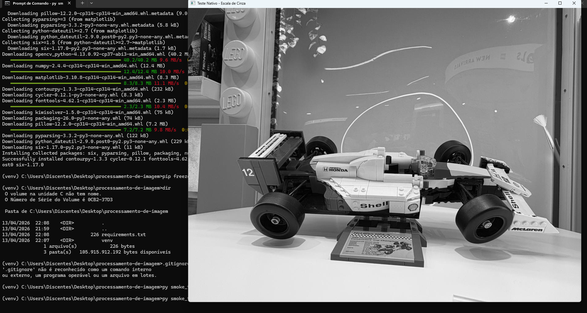

# Processamento de Imagem

**Aluno:** João Felipe Maciel Trindade  
**Curso:** Bacharelado em Ciência da Computação - UNEMAT  
**Semestre:** 2026/1  
**Disciplina:** Processamento de Imagens Digitais  

## Descrição do repositório

Este repositório reúne as entregas desenvolvidas para a disciplina de **Processamento de Imagens Digitais**, contemplando:

1. **Atividade Prática 1.2 - Implementação e Governança**
2. **Atividade Complementar - Configuração de Ambiente e Governança Git**

O objetivo deste repositório é demonstrar tanto a execução em nuvem com **Google Colab** quanto a configuração de um ambiente local de desenvolvimento com **Python**, **OpenCV**, **ambiente virtual**, **controle de dependências** e **teste nativo**.

---

## Atividade Prática 1.2 - Implementação e Governança

Esta atividade foi desenvolvida em **Jupyter Notebook (.ipynb)**, contendo os 20 exercícios propostos na disciplina, organizados com células de texto e código.

### Notebook da atividade

- `Atividade_Prática_1_2_Processamento_Digital_de_Imagens (1).ipynb`

### Imagens utilizadas

As imagens utilizadas no notebook são de **autoria própria** e estão disponíveis na raiz do repositório:

- `img01.jpeg`
- `img02.jpeg`
- `img03.jpeg`
- `img04.jpeg`
- `img05.jpeg`
- `img06.jpeg`
- `img07.jpeg`
- `img08.jpeg`
- `img09.jpeg`
- `img10.jpeg`

### Bibliotecas utilizadas

```bash
pip install opencv-python numpy matplotlib
```

### Execução no Google Colab

O notebook foi preparado para baixar as imagens diretamente do repositório público no GitHub, sem depender de caminhos locais do computador.

### Link para abrir no Google Colab

```text
https://colab.research.google.com/github/joaofelipeunemat/Processamento-de-imagem/blob/main/Atividade_Pr%C3%A1tica_1_2_Processamento_Digital_de_Imagens%20(1).ipynb
```

### Conteúdo desenvolvido no notebook

1. Carregamento de imagem colorida com correção BGR → RGB  
2. Exibição de atributos da imagem (`shape`, `size`, `dtype`)  
3. Salvamento da imagem em outro formato  
4. Leitura do pixel central  
5. Modificação de região com cor sólida  
6. Recorte de ROI  
7. Separação dos canais B, G e R  
8. Exibição isolada do canal verde  
9. Merge com troca de canais  
10. Conversão para tons de cinza  
11. Conversão para HSV com extração do canal de saturação  
12. Aumento de brilho com `cv2.add`  
13. Mesclagem de duas imagens com `addWeighted`  
14. Negativo fotográfico em escala de cinza  
15. Máscara binária circular  
16. Redução para 30% do tamanho original  
17. Cálculo de histograma  
18. Plot de histogramas dos canais de cor  
19. Equalização de histograma  
20. Aplicação de threshold binário simples  

---

## Atividade Complementar - Configuração de Ambiente e Governança Git

Esta etapa foi desenvolvida localmente, com foco na preparação do ambiente de desenvolvimento, versionamento do projeto e execução nativa com OpenCV.

### Arquivos relacionados à atividade complementar

- `.gitignore`
- `requirements.txt`
- `smoke_test.py`
- `evidencia_janela.png`

### Ambiente de Desenvolvimento

- **Sistema Operacional:** Windows 11 Pro 25H2  
- **Processador:** AMD Ryzen 3 PRO 3200G with Radeon Vega Graphics (3.60 GHz)  
- **RAM:** 8,00 GB  
- **Arquitetura do sistema:** 64 bits, processador baseado em x64  

### Ambiente virtual e .gitignore

Foi criado um ambiente virtual local para instalação isolada das dependências do projeto. A pasta do ambiente virtual foi adicionada ao arquivo `.gitignore`, evitando seu envio ao GitHub, conforme boas práticas de versionamento.

Conteúdo utilizado no `.gitignore`:

```text
venv/
__pycache__/
*.pyc
```

### Congelamento de dependências

Após a instalação das bibliotecas necessárias, foi gerado o arquivo `requirements.txt` com o seguinte comando:

```bash
pip freeze > requirements.txt
```

Esse arquivo registra as versões das dependências instaladas no ambiente local.

### Teste nativo com OpenCV

O arquivo `smoke_test.py` foi criado para validar a execução nativa do OpenCV no computador local, exibindo uma imagem autoral convertida para tons de cinza em uma janela do sistema operacional por meio de `cv2.imshow`.

### Evidência visual do teste nativo

Abaixo está a captura de tela da execução nativa do teste:



---

## Estrutura atual do repositório

```text
processamento-de-imagem/
├── .gitignore
├── README.md
├── requirements.txt
├── smoke_test.py
├── evidencia_janela.png
├── Atividade_Prática_1_2_Processamento_Digital_de_Imagens (1).ipynb
├── img01.jpeg
├── img02.jpeg
├── img03.jpeg
├── img04.jpeg
├── img05.jpeg
├── img06.jpeg
├── img07.jpeg
├── img08.jpeg
├── img09.jpeg
└── img10.jpeg
```

---

## Observação final

Este repositório foi organizado para atender aos critérios das duas atividades, priorizando:

- organização dos arquivos
- clareza da documentação
- execução correta no Google Colab
- execução nativa em ambiente local
- uso de imagens próprias
- boas práticas de governança com Git e GitHub
